# 🧠 JP Funware Admin Dashboard

A modern, fully responsive Admin Dashboard built with **React.js**, **Redux Toolkit**, **Bootstrap**, and **Recharts**. Designed for real-time analytics, charts, and user management — this dashboard delivers powerful insights into users, games, and transactions.

---

## 🚀 Live Preview

🌐 [JP Funware Admin Dashboard](https://jp-funware-admin-dashbaord.onrender.com)

---

## 📸 Screenshots

---

## 🛠️ Tech Stack

| Frontend  | State Management | Charts     | Routing      |
|-----------|------------------|------------|--------------|
| React.js  | Redux Toolkit    | Recharts   | React Router |
| Bootstrap | LocalStorage     | Chart.js*  | HashRouter   |

> 💡 Uses `HashRouter` for seamless routing in deployed environments  Render/GitHub Pages.

---

## 📦 Features

✅ Login with OTP simulation  
✅ Responsive layout with mobile-first design  
✅ Sidebar navigation with active highlights  
✅ Toggle for **Analytics Mode** (Cards ↔ Charts)  
✅ Toggle for **Dark / Light Theme**  
✅ Protected Routes using Redux login state  
✅ Caching API results
✅ Responsive UI

---

## 📁 Folder Structure

Src
 componenets
    api
        api [calling api inside it]
    pages
        Game
        Transaction
        Users
    redux
        dataSlice
        store
        userSlice
    routes    
        Private Route
    Dahsbaord.js
    Layout.js    

Live 
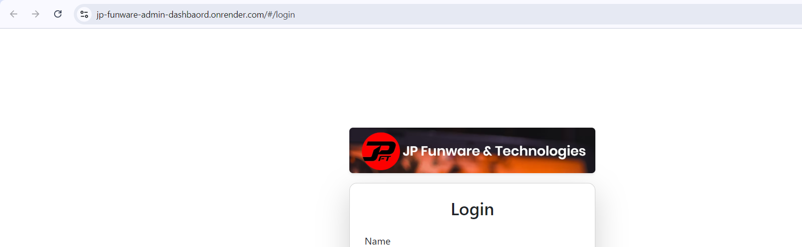
working ss
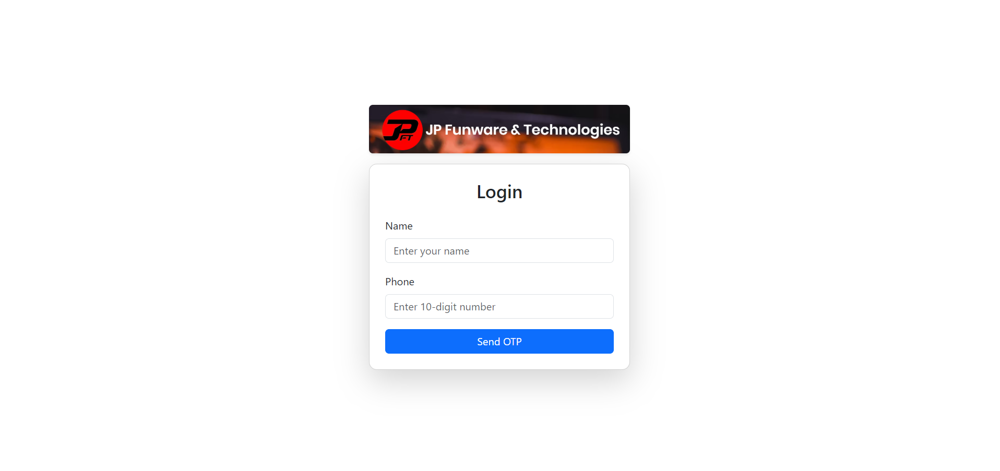

Login Screen
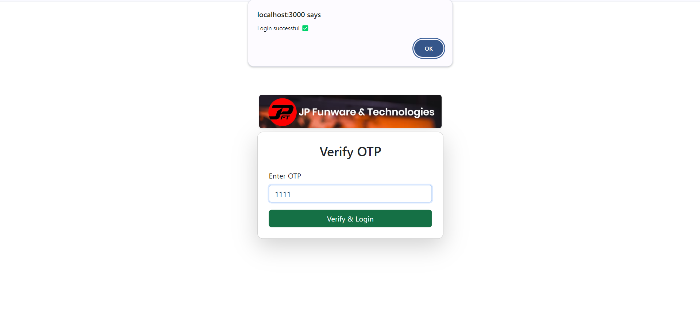

Main Dahsbaord

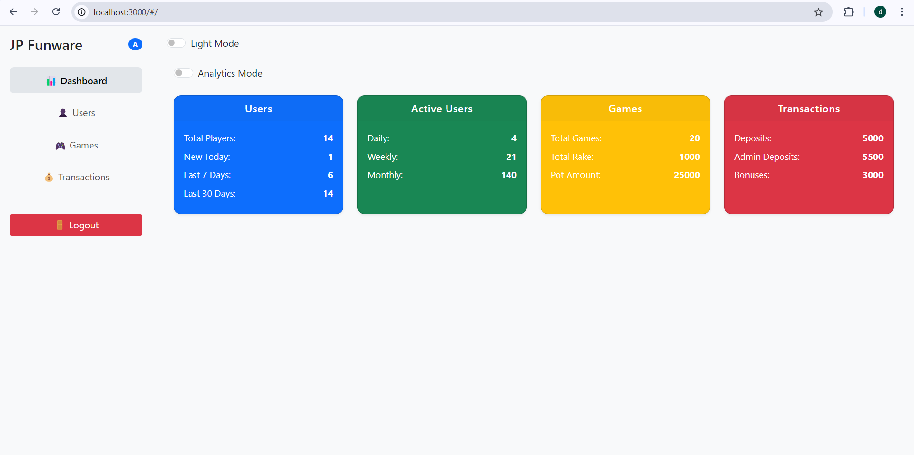

Sidebar
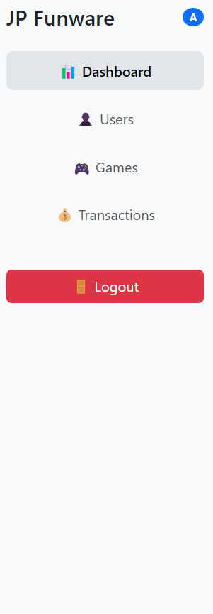
dark Mode Light Mode
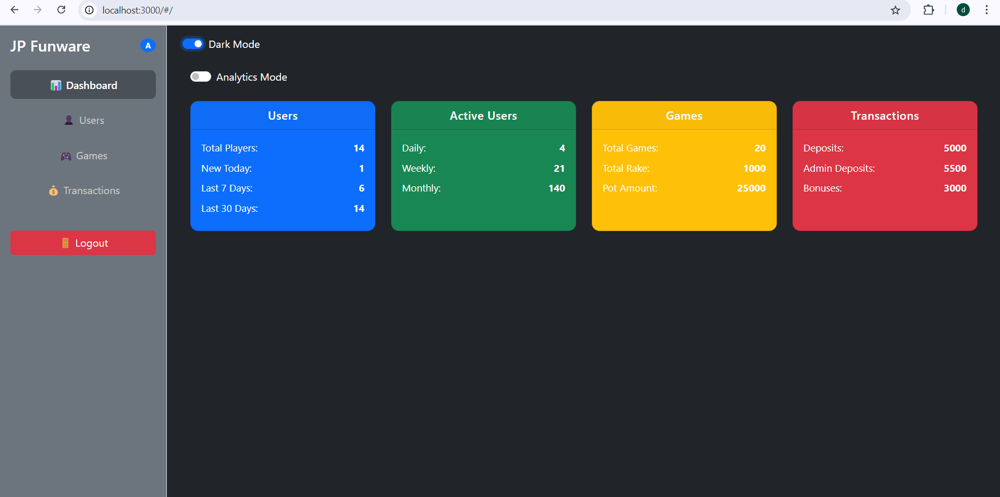
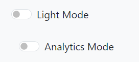

Users page 

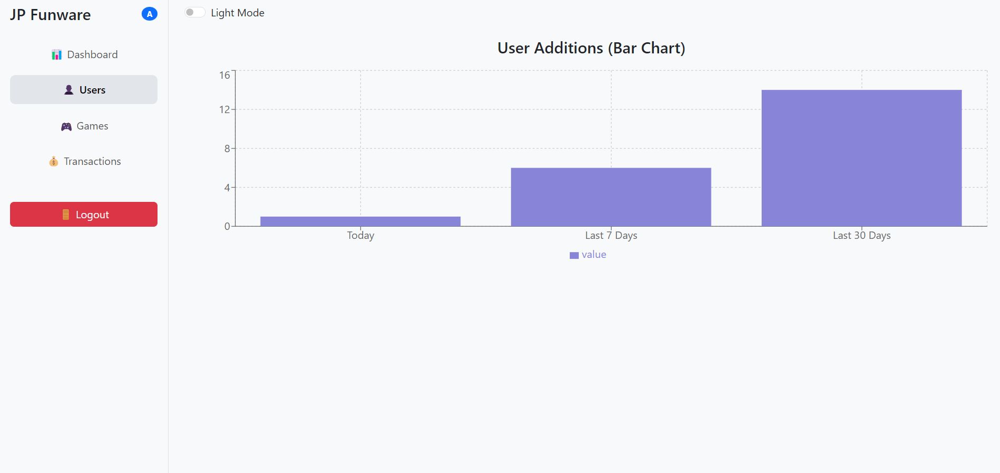

Games Chart 

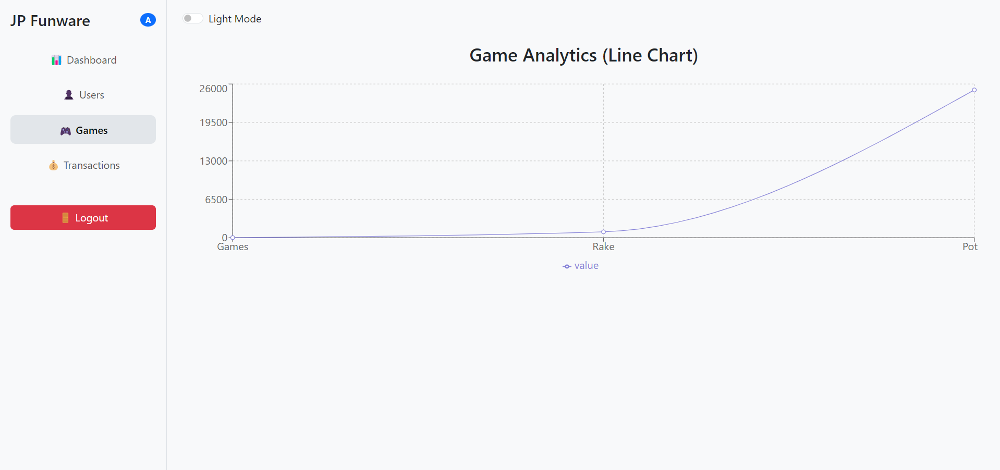

Transaction Chart
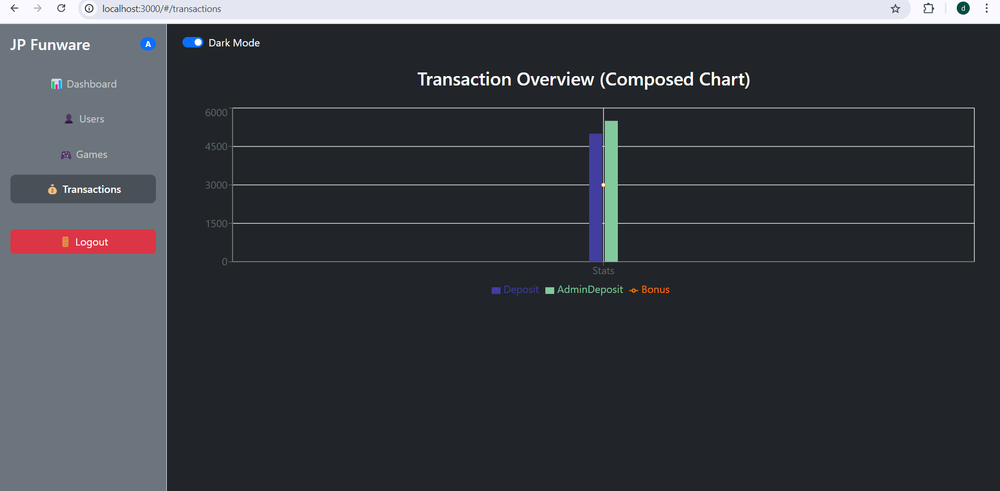

Analytics Mode
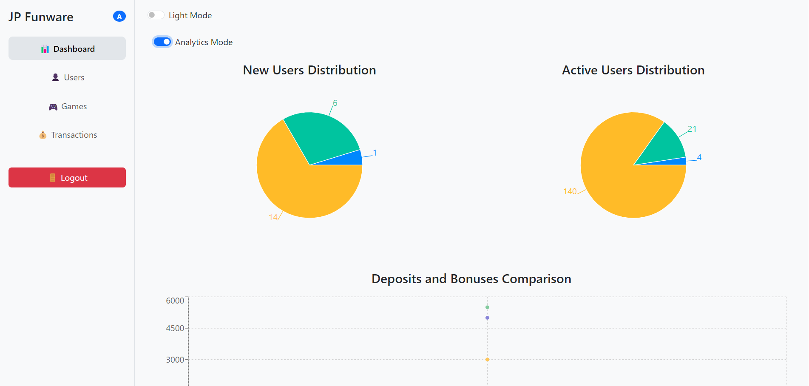
 Logout 
 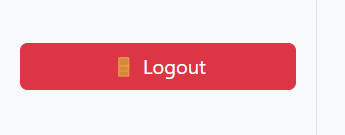

Redux 
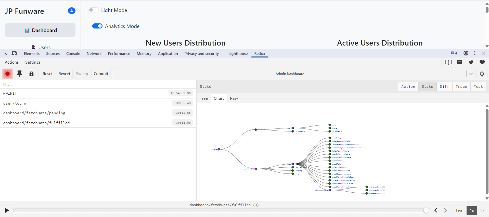
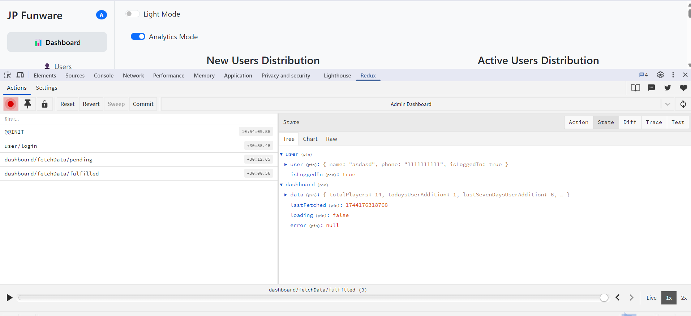

Live render 
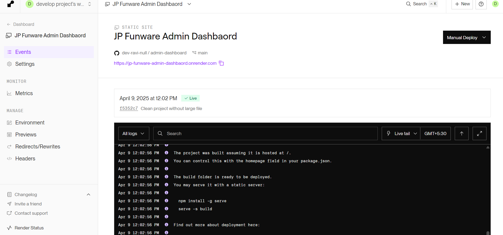
<!-- <video controls src="20250409-0530-53.8578725.mp4" title="Title"></video> -->